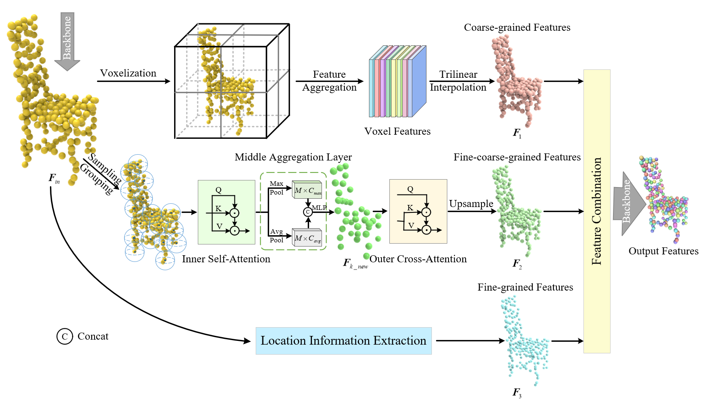
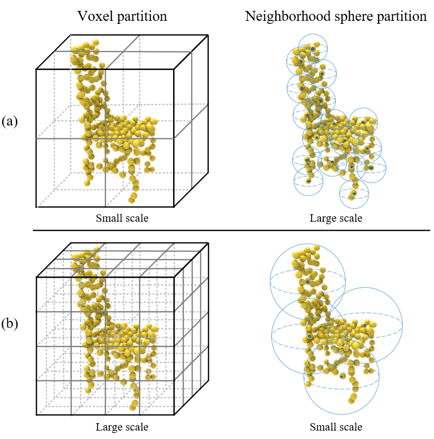
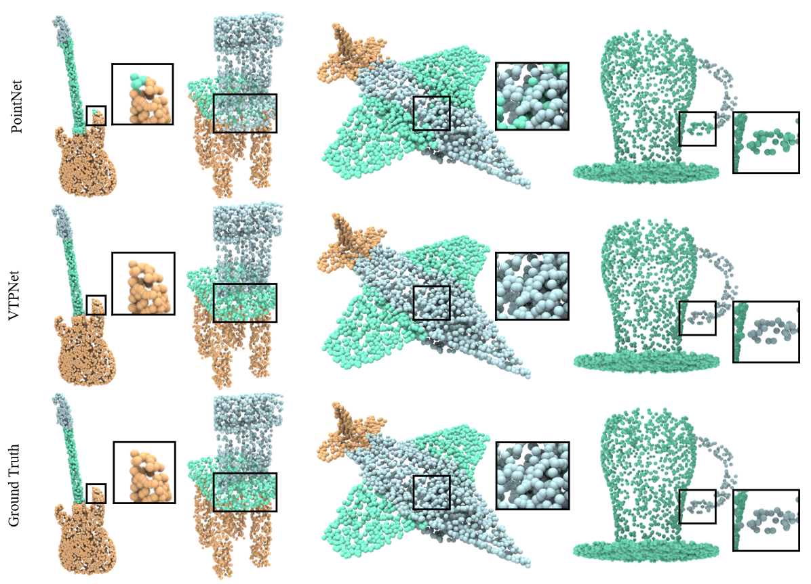
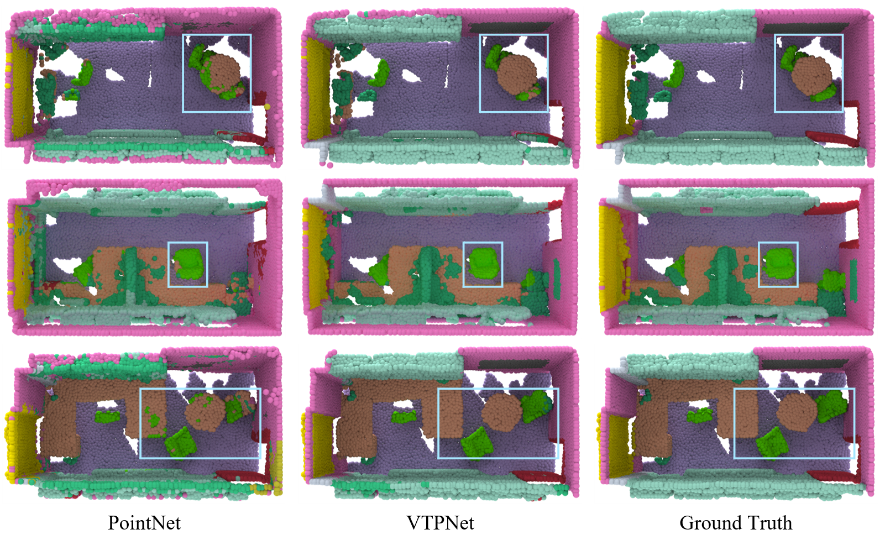

# CCMNet

## CCMNet for 3D deep learning on point cloud

According to the types of feature, the existing point cloud learning methods can be roughly divided into two categories: point-based and voxel-based methods. Most of the point-based methods generate individual features for each point by MLP, while the voxel-based methods calculate the neighborhood features for each local voxel cubic through 3D CNN, which leads to the features to be extremely fine-grained or coarse-grained. In addition, most of the previous methods learn multi-scale information with a single feature type, lacking multi-scale information composed of different types of features. To address the above issues, we propose CCMNet to learn 3D point cloud with coarse-to-fine-grained and cross-modal multi-scale features in this paper. The core parts of CCMNet consist of three level features from coarse to fine: coarse-grained, fine-coarse-grained and fine-grained features.
The coarse-grained features of the point cloud are obtained by 3D CNN with low voxel resolution; the fine-coarse-grained features (neither too fine nor too coarse-grained) are acquired by calculating the self-attention in the local neighborhood and cross-attention between the neighborhoods; the fine-grained features are gained by a simplified MLP network. Moreover, to enrich the local features of point clouds with different scales on different feature types, we set the voxel scale of coarse-grained features  and the neighborhood sphere scale of  fine-coarse-grained features differently (large voxel scale & small neighborhood sphere scale or small voxel scale & large neighborhood sphere scale). Finally, we use CCMNet as the feature extraction network, thus to classify and segment the point clouds. We carried out experiments on ModelNet40, ShapeNet Part and S3DIS datasets. 

### CCMNet deep learning network
<div  align="center">    
 
</div>

### Strategy "One large and one small" enriches local features of point cloud at different scales
<div  align="center">    
 
</div>

## 1. Requirements

- PyTorch >=1.7.0
- python >= 3.7
- CUDA >= 9.0
- GCC >= 4.9
- torchvision

```
pip install -r requirements.txt
```

## 2. Datasets

### ModelNet40

To use normal features for classification: You can get our sampled point clouds of ModelNet40 (XYZ and normal from mesh, 10k points per shape) [here (1.6GB)](https://shapenet.cs.stanford.edu/media/modelnet40_normal_resampled.zip). Set dataset path in [configs\modelnet\modelnet.yaml](configs\modelnet\modelnet.yaml)

### ShapeNet

We follow the data pre-processing in [PointNet2](https://github.com/charlesq34/pointnet2). Please run the following
command to down the dataset
```bash
./data/shapenet/download.sh
```
Set dataset path in [configs\shapenet\\\_\_init_\_.py](configs\shapenet\__init__.py)

### S3DIS

We follow the data pre-processing in [PointCNN](https://github.com/yangyanli/PointCNN).
The code for preprocessing the S3DIS dataset is located in [`data\s3dis\`](data/s3dis/prepare_data.py).
One should first download the dataset from [here](http://buildingparser.stanford.edu/dataset.html), then run 
```bash
python data/s3dis/prepare_data.py -d [path to unzipped dataset dir]
```
Set dataset path in [configs\s3dis\\_\_init\_\_.py](configs/s3dis/__init__.py)

## 3. Results of CCMNet on Each Dataset

### 3D object classification
|Method|mAcc(%)|OA(%)|
|:----:|:----:|:-----:|
|CCMNet|91.5|94.2|

### Part Segmentation
|Method| mIoU(%)|airplane|bag|cap|car|chair|earphone|guitar|knife|lamp|laptop|motorbike|mug|pistol|rocket|skateboard|table|
|:----:|:-----:|:-----:|:---:|:---:|:---:|:---:|:---:|:---:|:---:|:---:|:---:|:---:|:---:|:---:|:---:|:---:|:---:|
|CCMNet|85.8|84.4|87.5|85.6|79.8|91.2|74.1|91.2|84.8|84.5|96.0|76.1|95.4|82.8|61.3|77.9|82.9|
### Scene Semantic Segmentation (6-fold Cross-Validation)

|Method|miou|celling|floor|wall|beam|column|window|door|table|chair|sofa|bookcase|board|clutter|
|:----:|:----:|:----:|:----:|:----:|:----:|:----:|:----:|:----:|:----:|:----:|:----:|:----:|:----:|:----:|
|CCMNet|67.3|95.2|97.4|81.8|59.3|45.0|63.7|68.8|72.5|73.9|44.3|59.9|53.1|60.4|

## 3. CCMNet for Classification and Segmentation

### 3D object classification

To train CCMNet on ModelNet40, one need to first set __test__ in `configs\modelnet\modelnet.yaml` to False, then run
```
python train_modelnet.py --config configs\modelnet\modelnet.yaml
```
To evaluate CCMNet on ModelNet40, one need to first set __test__ in `configs\modelnet\modelnet.yaml` to True, then run
```
python train_modelnet.py --config configs\modelnet\modelnet.yaml
```

### Part Segmentation

To train CCMNet on ShapeNet, one can run
```
python train_shapenet.py configs\shapenet\model\c1.py --devices 0,1
```
To evaluate CCMNet on ShapeNet, one can run
```
python train_shapenet.py configs\shapenet\model\c1.py --devices 0,1 --evaluate
```
Visualize the segmentation results of the model, one can run
```
python train_shapenet.py configs\shapenet\model\c1.py --devices 0,1 --evaluate --visual
```
**NOTE**: The. obj point cloud file will be generated in the __visual_out_shapenet__ folder and can be opened using the Meshlab software.

### Scene Semantic Segmentation

To train CCMNet on S3dis (holding out Area 5), one can run
```
python train_s3dis.py configs\s3dis\model2\area5\c1.py --devices 0,1
```
To evaluate CCMNet on ShapeNet, one can run
```
python train_s3dis.py configs\s3dis\model2\area5\c1.py --devices 0,1 --evaluate
```
Visualize the segmentation results of the model, one can run
```
python train_s3dis.py configs\s3dis\model2\area5\c1.py --devices 0,1 --evaluate --visual
```
**NOTE**: The. obj point cloud file will be generated in the __visual_out_s3dis__ folder and can be opened using the Meshlab software.

## Visualization Results Display
### Part segmentation
<div  align="center">    
 
</div>

### Scene Semantic Segmentation
<div  align="center">    
 
</div>

## Acknowledgement

Our codes are built upon [PVCNN](https://github.com/mit-han-lab/pvcnn), [Pointnet2_PyTorch](https://github.com/erikwijmans/Pointnet2_PyTorch) and [Pointnet_Pointnet2_pytorch](https://github.com/yanx27/Pointnet_Pointnet2_pytorch)